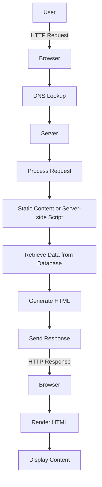

### 1. Perbedaan website statis dan dinamis beserta contohnya :

### Website Statis
- Konten Tetap: 
Konten pada web statis tidak berubah kecuali secara manual diubah oleh pengembang. Setiap halaman ditulis dalam HTML dan tetap sama setiap kali diakses.
*Contoh:  portfolio pribadi, "About" Halaman Tentang Perusahaan, brosus digital atau landing page*
### Website Dinamis
- Konten Berubah-ubah :
Konten pada web dinamis dapat berubah berdasarkan interaksi pengguna atau faktor lain. Menggunakan skrip sisi server (seperti PHP, ASP .NET) dan basis data untuk menghasilkan konten secara dinamis.
*Contoh: Situs Sosial media, Situs Nonton Film, Wordpress Blog, Forum Online.*

### 2. Representasi cara kerja sebuah website menggunakan flowchart:



Penjelasan:

1. **User**: Pengguna mengirimkan permintaan melalui browser.
2. **Browser**: Browser menginisiasi permintaan HTTP ke alamat website.
3. **DNS Lookup**: Browser melakukan pencarian DNS untuk menemukan alamat IP dari server.
4. **Server**: Permintaan diterima oleh server.
5. **Process Request**: Server memproses permintaan yang masuk.
6. **Static Content or Server-side Script**: Server memeriksa apakah permintaan adalah untuk konten statis atau perlu menjalankan skrip sisi server.
7. **Retrieve Data from Database**: Jika diperlukan, server mengambil data dari basis data.
8. **Generate HTML**: Server menghasilkan HTML berdasarkan permintaan dan data yang diambil.
9. **Send Response**: Server mengirimkan respons berupa halaman HTML ke browser.
10. **HTTP Response**: Browser menerima respons HTTP.
11. **Render HTML**: Browser merender (mengolah) HTML.
12. **Display Content**: Konten ditampilkan kepada pengguna.


### 3. Client Side Programming dan Server Side Programming
### Client Side Programming
Client-side programming adalah teknik pemrograman yang mengeksekusi kode di sisi klien, biasanya di dalam web browser pengguna. Kode ini bertanggung jawab untuk interaksi langsung dengan pengguna, manipulasi DOM, validasi form di sisi klien, dan mempercantik tampilan halaman web. Teknologi utama yang digunakan untuk client-side programming mencakup HTML, CSS, dan JavaScript.

*Contoh: HTML, CSS, Javascript, FrameworkLibrary (Vue,React,Angular)*

### Server Side Programming
Server-side programming adalah teknik pemrograman yang mengeksekusi kode di sisi server. Kode ini bertanggung jawab untuk mengelola logika bisnis, interaksi dengan basis data, otentikasi dan otorisasi pengguna, serta mempersiapkan data untuk dikirimkan ke klien. Teknologi utama yang digunakan untuk server-side programming mencakup bahasa seperti PHP, Python, Ruby, Java, dan Node.js.

*Contoh: PHP, Python, Node.js, Java*.

### 4. Membuat web statis HTML sederhana
```html
<!DOCTYPE html>
<html>
<head>
    <title>Perkenalan HTML</title>
</head>
<body>
    <h1>HTML Itu Mudah</h1>
    <a href="https://wikipedia.org/">Hello Wikipedia</a>
    <p class="paragraph">Hello World</p>
</body>
</html>
```
### 5. Penjelasan HTML Tags dan plain text

### Penjelasan Kode

1.  **`<!DOCTYPE html>`**:
    
    -   Deklarasi tipe dokumen yang menginformasikan browser bahwa dokumen ini adalah HTML5.
2.  **`<html>`**:
    
    -   Tag root yang membungkus semua konten halaman web.
3.  **`<head>`**:
    
    -   Bagian dari dokumen HTML yang berisi metadata, seperti judul halaman yang ditampilkan di tab browser.
    -   **`<title>`**: Mengatur judul halaman sebagai "Example of HTML frames using col attributes".
4.  **`<frameset>`**:
    
    -   Digunakan untuk mendefinisikan layout menggunakan frame. Elemen ini menggantikan elemen `<body>` dalam dokumen HTML yang menggunakan frame.
    -   **`cols="30%, 40%, 30%"`**: Membagi halaman menjadi tiga kolom dengan lebar masing-masing 30%, 40%, dan 30%.
5.  **`<frame>`**:
    
    -   Menentukan masing-masing frame dalam frameset.
    -   **`<frame name="top" src="C:/Users/dharam/Desktop/attr1.png" />`**: Membuat frame pertama dengan nama "top" dan menampilkan konten dari file `attr1.png` yang ada di direktori lokal.
    -   **`<frame name="main" src="C:/Users/dharam/Desktop/gradient3.png" />`**: Membuat frame kedua dengan nama "main" dan menampilkan konten dari file `gradient3.png` yang ada di direktori lokal.
    -   **`<frame name="bottom" src="C:/Users/dharam/Desktop/col_last.png" />`**: Membuat frame ketiga dengan nama "bottom" dan menampilkan konten dari file `col_last.png` yang ada di direktori lokal.
6.  **`<noframes>`**:
    
    -   Digunakan untuk memberikan konten alternatif kepada pengguna yang browsernya tidak mendukung frame.
    -   **`<body>`**: Di dalam tag `<noframes>`, menyediakan elemen `<body>` alternatif yang berisi teks biasa yang akan ditampilkan jika frame tidak didukung.
7.  **Teks biasa**:
    
    -   `"the browsers you are working does not support frames."`: Pesan yang akan ditampilkan di dalam elemen `<noframes>` untuk memberi tahu pengguna kalau browser mereka tidak mendukung frame.


### 6. Penggunaan attribut kolom baris pada html code diatas:
```html
<!DOCTYPE html>
<html>
<head>
    <title>Example of HTML frames using row attributes</title>
</head>
<frameset rows="30%, 40%, 30%">
    <frame name="top" src="C:/Users/dharam/Desktop/attr1.png" />
    <frame name="main" src="C:/Users/dharam/Desktop/gradient3.png" />
    <frame name="bottom" src="C:/Users/dharam/Desktop/col_last.png" />
    <noframes>
        <body>
            The browsers you are using do not support frames.
        </body>
    </noframes>
</frameset>
</html>
```

### 7. Merubah Penggunaan CSS inline ke penggunaan CSS internal :
```html
<!DOCTYPE html>
<html>
<head>
    <title>Contoh inline styles CSS</title>
    <style>
        h2 {
            background-color: black;
            color: white;
        }
    </style>
</head>
<body>
    <h2>
        teks ini akan berwarna putih dan background berwarna hitam
    </h2>
</body>
</html>

```

### 8. Menjelaskan kode menurut pendapat saya:
- `var` adalah salah satu script tag yg biasanya ditemukan pada baris kode bahasa program javascript dan harus ditulis dengan huruf kecil.
- `console.log` adalah perintah untuk menampilkan hasil atau output penghitungan dan harus ditulis dengan huruf kecil.
- `x` di inisialisasi dengan angka 5.
- `y` di inisialisasi dengan angka 4.
- `z` di inisialisasi dengan angka 5.
- `w` di inisialisasi dengan rumus yaitu `y+z` atau `5+4`.
- `nama` di inisialisasi dengan "agus".
- `console.log(w)`adalah perintah untuk memunculkan hasil dari rumus `y+z`.

